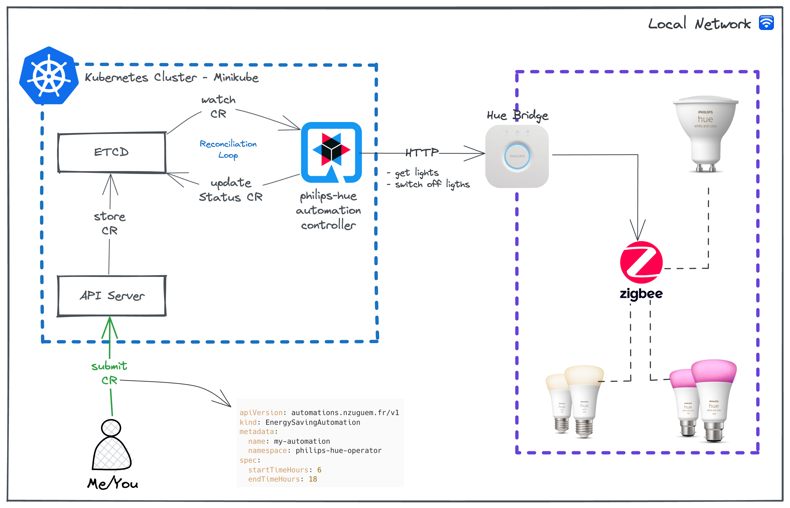

# What is this project ?
This project aims to experiment and understand the Kubernetes operator pattern.

To give it a realistic dimension, I've chosen the energy and IoT sector, under the prism of energy sobriety.

The idea is to develop a Kubernetes operator that will help reduce our energy consumption. This is achieved by acting on Philips Hue connected lights during a configured period.

# Illustration



# I'm testing this

If you have a hue bridge at home with connected lights, then follow the steps below to launch and/or modify this project.

> 🥲 Otherwise, it will be impossible to test it

## Philips Hue configuration
1. Get hue bridge IP
   ```bash
   curl https://discovery.meethue.com
   # Response -> [{"id":"ID_du_pont","internalipaddress":"<HUE_BRIDGE_IP>"}]
   ```
2. Obtain an authentication token, to be able to place commands to the Hue system
    > ⚠️ Before executing the command below, press the button on top of the Bridge, this will put it in pairing mode.
   ```bash
    curl -X POST -d '{"devicetype":"my_hue_app#philips-hue-operator"}' <HUE_BRIDGE_IP>/api
    # Response -> [{"success":{"username":"<HUE_BRIDGE_API_TOKEN>"}}]
   ```

## Launch the project
### Prerequisites
- Must have Java 17 + (You can install it via [SDKMan][sdkman-doc])
- Have a local kubernetes cluster (you can use [Minikube][minikube-install])

### Execute command
```bash
./mvnw quarkus:dev -DHUE_API_URL="http://<HUE_BRIDGE_IP>" -DHUE_API_TOKEN="<HUE_BRIDGE_API_TOKEN>"; 
```

### Submit your first automation 🚀
You can modify [energy-saving-automation.yml](src/test/resources/energy-saving-automation.yml) as you wish
```yaml
apiVersion: automations.nzuguem.fr/v1
kind: EnergySavingAutomation
metadata:
  name: my-automation
  namespace: philips-hue-operator
spec:
  startTimeHours: 6
  endTimeHours: 18
```

```bash
kubectl create ns philips-hue-operator 
```
```bash
# If you have kubectl installed
kubectl apply -f src/test/resources/energy-saving-automation.yml
```

# Would you like to go to PROD 😁 ?
You have just tested the project in Dev Mode Quarkus💙 and only the CRDs (Custom Resource Definition) are deployed in your cluster, BUT not your controller.

Your goal is to deploy the controller in your cluster.

> ⚠️ By default, a Docker container uses UTC as its timezone. All the timestamps and operations inside the Docker container are based on Coordinated Universal Time, regardless of the host machine’s timezone. This standardization ensures the smooth running of applications in different geographical locations. However, there may be instances where you need to set a different timezone within a Docker container.
> 
> In order for the controller to run automations correctly, you must adapt your time zone in [application.properties](src/main/resources/application.properties) : `quarkus.kubernetes.env.vars.TZ=<YOUR_TIMEZONE>`

## Go PROD 🚀
1. Build the Docker image using Minikube's Docker daemon, Docker images will be directly accessible in the Kubernetes cluster, without the need for a registry.
```bash
eval $(minikube -p minikube docker-env)
make docker-build
```

2.  Create the namespace, secret and configmap required by the controller
```bash
k8s/configure.sh "<HUE_BRIDGE_IP>" "<HUE_BRIDGE_API_TOKEN>"
```

3. Apply yaml manifests generated by the Kubernetes Quarkus extension
> 💙 Yes !!! YAML manifests are generated by Quarkus. The strength of Quarkus lies in its extensions, and in our case, it's the Kubernetes extension.
```bash
# Apply CRDs
make install
# Apply Controller
make deploy
```

4. Submit automation
```bash
# If you have kubectl installed
kubectl apply -f src/test/resources/energy-saving-automation.yml
```

5. Check logs of controller
```bash
 kubectl logs -n philips-hue-operator -f po/<POD_OPERATOR_CONTROLLER>
```
## Uninstall operator 🗑️
```bash
# Delete CRDs
make uninstall
# Delete controller
make undeploy
```
# Useful links 🔗
- [Quarkus][quarkus-doc]
- [Quarkus Java Operator SDK][quarkus-josdk-doc]
- [Kubernetes Operator pattern][k8s-operator-pattern]

<!-- Links -->
[sdkman-doc]: https://sdkman.io/
[minikube-install]: https://minikube.sigs.k8s.io/docs/start/
[quarkus-doc]: https://quarkus.io/
[quarkus-doc]: https://quarkus.io/
[quarkus-josdk-doc]: https://docs.quarkiverse.io/quarkus-operator-sdk/dev/index.html
[k8s-operator-pattern]: https://kubernetes.io/docs/concepts/extend-kubernetes/operator/